# ipo_underpricing_model

A measurement study of first-day returns on US IPOs listed between 2019 and 2024, combining SEC prospectus text, deal terms, underwriter reputation and market regime.

[](LICENSE)
[](pyproject.toml)

## Results

The short version: first-day IPO returns are not forecastable from anything observable before the first trade. One prospectus-text effect does survive multiple-testing correction — prospectuses with more legal language pop less — but it disappears the moment you control for deal size, offer price and market regime, so it is a proxy for the deal, not information in the text.

**Out-of-sample prediction** ([`model_cv_summary.csv`](reports/tables/model_cv_summary.csv), [`model_holdout_2024.csv`](reports/tables/model_holdout_2024.csv))

| Model | CV R² (mean) | CV R² (min → max across folds) | CV MAE | Holdout 2024 R² |
|---|---:|---:|---:|---:|
| Baseline: predict training median | **−0.026** | −0.071 → −0.000 | 0.565 | **−0.001** |
| Baseline: predict training mean | −0.217 | −0.770 → −0.008 | 0.699 | −0.918 |
| Ridge | −0.557 | −1.429 → +0.001 | 0.826 | −1.859 |
| LightGBM | −2.154 | −6.931 → −0.002 | 0.925 | −7.947 |
| Random forest | −1.918 | −5.277 → −0.001 | 0.938 | −8.675 |

Every model is worse out-of-sample than predicting a constant, in every fold and on the holdout. Five-fold expanding-window `TimeSeriesSplit` over 709 listings; the holdout trains on 560 listings before 2024-01-01 and scores the 149 that follow. Nor do the models rank well: mean Spearman ρ across folds is 0.10 for LightGBM (sd 0.23) and 0.05 for the random forest, and on the 2024 holdout both are *negative*.

**Hypothesis tests** ([`hypothesis_summary.csv`](reports/tables/hypothesis_summary.csv))

| Test | Question | Estimate | n | p (raw) | p (Bonferroni) | Verdict |
|---|---|---:|---:|---:|---:|---|
| H1 | Does litigious prospectus language predict the first-day return? | ρ = −0.112 [−0.188, −0.037] | 666 | 0.0039 | 0.023 | **Reject — but see below** |
| H2 | Do top-tier underwriters attenuate H1? | β = +7.49 | 417 | 0.83 | 1.00 | Fail to reject |
| H3 | Does the *location* of negative tone matter? | ρ = +0.060 [−0.034, +0.152] | 408 | 0.22 | 1.00 | Fail to reject |
| H4 | Does VIX change the *variance* of returns? | Levene W = 2.39 / Fligner χ² = 38.4 | 709 | 0.093 / 4.7e−09 | 0.56 / 2.8e−08 | **Depends on the test** |
| H5 | Do top-tier underwriters reduce that variance? | Levene W = 7.34 / Fligner χ² = 3.33 | 512 | 0.0070 / 0.068 | 0.042 / 0.41 | **Not robust** |
| H6 | Do text features add fit over deal and market controls? | LR χ²(7) = 7.14 | 284 | 0.41 | 1.00 | Fail to reject |

Six tests at α = 0.05 carry a family-wise error rate near 26%, so raw and adjusted p-values are both shown. H4 and H5 are variance tests on a target with a very heavy right tail, and the conventional test disagrees with the rank-based one in **opposite directions**, so I publish both families ([Levene](reports/tables/multiple_testing_levene.csv), [rank-based](reports/tables/multiple_testing_rank_based.csv)) rather than picking the flattering one:

- **H4 is real.** The interquartile range of the first-day return is 35.9% in the low-VIX tercile, 34.9% in the mid, and 56.4% in the high. Levene misses it because one micro-cap inflates the mid tercile's standard deviation to 335%. Volatility widens the spread of first-day returns without moving their centre.
- **H5 is not.** Levene rejects at p = 0.0070 and survives Bonferroni, but Fligner–Killeen gives p = 0.068, and the rejection is driven by a handful of extreme non-top-tier observations rather than by a difference in typical spread.

**On H1, which is the one test that rejects.** The bivariate rank association is real and survives both corrections, it strengthens when the least reliable prices are dropped (ρ = −0.140), and it survives controlling for document length (partial rank ρ = −0.096, p = 0.013). It does **not** survive controlling for deal size, offer price, market regime and underwriter reputation: partial rank ρ = −0.015, p = 0.76. That collapse is not a sample-size artefact — on exactly the same 417 rows, the bivariate estimate is −0.117 (p = 0.017). Litigious language is standing in for the kind of deal, not adding information to it. No individual listing year is significant, and 2022 has the opposite sign. The full table is in [Validation](#h1-robustness).

Note also that Litigious is **not** the only category that moves: `lm_positive_ratio` is significant in the opposite direction (ρ = +0.113, Bonferroni p = 0.024). Two of seven categories reach significance, pointing opposite ways, on the same sample.

**Descriptive** ([`descriptive_statistics.csv`](reports/tables/descriptive_statistics.csv))

Median first-day return +7.9%, mean +40.3%, 62.1% closed above the offer price (n = 709). By listing year the median runs +11.9% (2019), +27.7% (2020), +10.5% (2021), +4.0% (2022), 0.0% (2023), +1.7% (2024).

**What changed from the previous version of this repository.** All of it. The earlier README reported a "litigious-tone paradox" at ρ = −0.206, p = 0.0003, a median first-day return stepping from +48.3% to +6.0% across quintiles, and the claim that the effect "survives multivariate OLS with deal, market and sector controls". Those numbers were computed on a target variable that was not underpricing, and the multivariate claim is the one the corrected data most clearly contradicts — see [Validation](#validation) and [FIXES.md](FIXES.md).

## Quickstart

```bash
git clone https://github.com/leeyawnnn/ipo_underpricing_model.git
cd ipo_underpricing_model
python -m venv .venv && source .venv/bin/activate
pip install -r requirements-dev.txt          # macOS also needs: brew install libomp

python scripts/build_figures.py              # every figure, from committed data
python scripts/check_figures.py reports/figures
pytest -q
```

That runs on a clean clone: `data/processed/analysis_sample.parquet` and `reports/tables/` are committed, so the figures and tests need no network access. To rebuild the dataset from source instead:

```bash
export SEC_EDGAR_USER_AGENT="Your Name your.email@example.com"   # SEC fair access
export SCRAPER_CONTACT="your.email@example.com"

python scripts/fetch_lm_dictionary.py        # LM dictionary, SHA-256 verified
python scripts/fetch_underwriter_ranks.py    # Ritter Carter-Manaster ranks
python -m src.scraper_ipo_calendar           # IPO calendar (~1 min)
python scripts/fetch_sic_codes.py            # SEC SIC codes (~4 min)
python -m src.scraper_edgar                  # S-1/F-1 prospectuses (hours)
python -m src.scraper_prices                 # first-day closes (~12 min)

python scripts/build_dataset.py              # join, feature-engineer, funnel
python scripts/run_analysis.py               # every table in reports/tables/
python scripts/build_figures.py
```

## What this is

IPO underpricing is the gap between the price an issuer sells shares at and the price the market pays hours later. It is one of the oldest puzzles in corporate finance: issuers routinely leave money on the table, and the size of the gap varies enormously across deals and across time. The dominant explanations are informational — Rock's winner's-curse, Benveniste–Spindt bookbuilding, Carter–Manaster's underwriter certification — and they all imply that something knowable before the offering should predict the gap.

The specific question here is whether the *prospectus text* is one of those things. An S-1 is the most detailed document an issuer ever publishes about itself, it is filed weeks before pricing, and it is machine-readable. Hanley and Hoberg (2010) show that the informative content of a prospectus, separated from its boilerplate, predicts both the price revision and the first-day return. Loughran and McDonald (2011) show that general-purpose sentiment dictionaries misclassify finance writing badly enough to matter — *liability*, *tax*, *cost* and *capital* read as negative in ordinary English and are neutral in a 10-K — and provide a dictionary built on SEC filings instead.

So the design is: take every US IPO in a six-year window, score its prospectus with the finance-specific dictionary, add the deal terms and the market regime the issuer priced into, and ask what predicts the first-day return.

The answer, on this sample, is essentially nothing. That is not a failed project. Ritter and Welch (2002) are explicit that the cross-section of first-day returns is close to unforecastable from public pre-IPO information, and a null that is measured carefully is worth more than a positive result that turns out to be an artefact. What this repository is *for* is the measurement: a target reconstructed from first-day closes with the split corrections Yahoo requires, sectors from SEC-assigned SIC codes instead of a name regex, underwriter reputation matched to Jay Ritter's actual Carter–Manaster file, and a sample funnel that says exactly how many IPOs survived each requirement and why.

## Method

| Step | Module | What it does |
|---|---|---|
| Calendar | [`src/scraper_ipo_calendar.py`](src/scraper_ipo_calendar.py) | Ticker, name, listing date, offer price for 1,773 listings |
| First-day price | [`src/scraper_prices.py`](src/scraper_prices.py) | Unadjusted first-day close, with split correction; the target |
| Prospectus text | [`src/scraper_edgar.py`](src/scraper_edgar.py) | S-1/F-1 body plus Risk Factors and MD&A extracts |
| Sector | [`src/sic_sectors.py`](src/sic_sectors.py) | SEC-assigned SIC → sector, via a committed crosswalk |
| Underwriters | [`src/underwriters.py`](src/underwriters.py) | Syndicate from the cover page → Carter-Manaster rank |
| Tone and readability | [`src/text_features.py`](src/text_features.py) | Loughran-McDonald ratios, Gunning Fog |
| Assembly | [`src/dataset.py`](src/dataset.py) | Joins, lagged market state, sample funnel |
| Features | [`src/feature_engineering.py`](src/feature_engineering.py) | Deal size, uniqueness, derived ratios |
| Tests | [`src/hypothesis_tests.py`](src/hypothesis_tests.py) | Six tests, bootstrap CIs, multiple-testing correction |
| Models | [`src/models.py`](src/models.py) | Expanding-window CV, baselines, holdout, SHAP |

### How tone is measured

Not by an LLM and not by a general-purpose word list. The **Loughran–McDonald (2011)** dictionary is the standard for SEC filings because it was built from them. Each prospectus is lower-cased, stripped of punctuation and bare numerals, and tokenised; tokens are matched against each category; the count is divided by the total token count so the score does not depend on document length.

| Category | Words | Example matches |
|---|---:|---|
| Negative | 2,355 | abandon, adverse, breach, decline, lawsuit |
| Positive | 354 | able, accomplish, achieve, profitable |
| Uncertainty | 297 | almost, anticipate, assume, perhaps |
| Litigious | 905 | adjudicate, allegation, appeal, plaintiff |
| Constraining | 184 | bound, compelled, must, prohibit |
| Modal-strong | 19 | always, definitely, must |
| Modal-weak | 27 | almost, conceivably, depend |

Counts are from the pinned 1993–2025 release, verified by SHA-256 in [`scripts/fetch_lm_dictionary.py`](scripts/fetch_lm_dictionary.py) and recorded in [`lm_sentiment_words.meta.json`](data/external/lm_sentiment_words.meta.json). Ratios are computed twice: on the full prospectus (`lm_*_ratio`) and on the Risk Factors section alone (`rf_lm_*_ratio`). Their ratio, `risk_concentration_ratio`, is how much of a filing's negative tone sits where the SEC asks for it — the H3 measure.

### Sector, from SIC rather than from the company name

The previous classifier inferred sector from the company name with a layered regex whose last rule was *"fall back to the broad Industrials bucket. We never emit Unknown or Other/Diversified."* Instrumenting it ([`legacy_sector_classifier_layers.csv`](reports/tables/legacy_sector_classifier_layers.csv)) shows what that cost:

| Layer | Rows | Share |
|---|---:|---:|
| Existing label | 140 | 7.9% |
| Ticker override | 55 | 3.1% |
| Strong SPAC pattern | 500 | 28.2% |
| Keyword match | 501 | 28.3% |
| Weak SPAC pattern | 54 | 3.0% |
| Suffix heuristic | 5 | 0.3% |
| **Silent fallback to Industrials** | **518** | **29.2%** |

96.3% of everything the old README labelled Industrials arrived there through the fallback, so the published "Industrials = 494" bar was largely a measure of the classifier's own failure rate. Sector now comes from the registrant's SEC-assigned SIC code through [`sic_gics_crosswalk.csv`](data/external/sic_gics_crosswalk.csv), an 87-row table a reader can disagree with line by line. SIC 6770 is the SEC's own "Blank Checks" code, so SPACs are identified by the regulator rather than by a name pattern. A company with no recoverable SIC is labelled `Unclassified` and counted: 24 of 709 rows, 3.4%.

### Underwriters, recovered from the prospectus cover

The IPO calendar has no underwriter column at all, which is why the old repository's Ritter merge produced nothing and H2 and H5 shipped as "Skipped". The syndicate is instead read off the prospectus cover page, matched through a committed alias table with no fuzzy matching, and joined to Jay Ritter's Carter–Manaster ranks. Two false-positive sources needed fixing: the "Copies to:" block names outside counsel by personal name (*Michael Benjamin* of Latham & Watkins was matching Benjamin Securities; *Morrison Cohen LLP* was matching Cohen & Co), and some issuers are themselves brokers (Futu Holdings matched Futu Securities).

**Match rate: 526 of 666 filings (79.0%) name at least one recognised underwriter; 512 (76.9%) resolve to a Ritter rank.** Ranks are period-specific — Credit Suisse is 8.5 in Ritter's 2018–20 column and 8.0 in 2021–22 — and each IPO is matched to the column covering its listing year.

## Figures

All twelve regenerate with `python scripts/build_figures.py` and carry a provenance footer naming the source, the as-of date and the commit.

### 1. Distribution of first-day returns
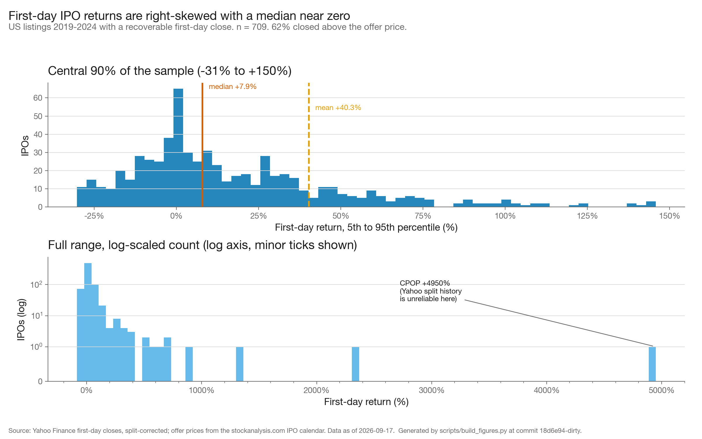

The top panel is the central 90% of the sample on a linear scale; the bottom is the full range with a log-scaled count. Read the gap between the median rule and the mean rule: the mean is three times the median because a handful of micro-caps dominate it. The typical IPO closes a few percent above its offer price, and the headline pops are a tiny minority.

### 2. Sector composition
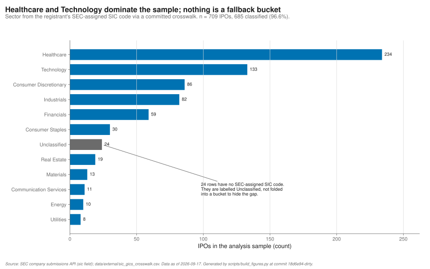

Horizontal bars sorted by count, linear scale, direct-labelled. Grey marks the 24 rows with no SEC-assigned SIC code, which are labelled `Unclassified` rather than folded into a real sector. Healthcare and Technology dominate; no bar here is a fallback bucket.

### 3. Median return by sector and year
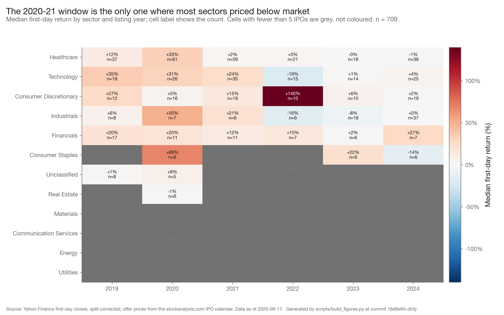

Colour is the median first-day return, diverging about zero; the cell label gives the median and the count. Cells with fewer than five IPOs are grey rather than coloured, because a median of three observations is not a measurement. The 2020–21 band is the only period in which most sectors priced materially below where the market cleared.

### 4. Tone deciles
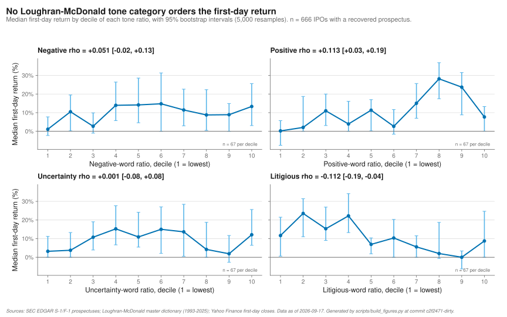

Median first-day return by decile of each Loughran–McDonald ratio, with 95% bootstrap intervals and Spearman ρ with its own interval in each title. Read the slope against the error bars, not the points. Two of seven categories reach significance and they point in opposite directions: Litigious at ρ = −0.112 and Positive at ρ = +0.113, both surviving Bonferroni correction across the seven. The other five are indistinguishable from zero.

### 5. VIX and dispersion
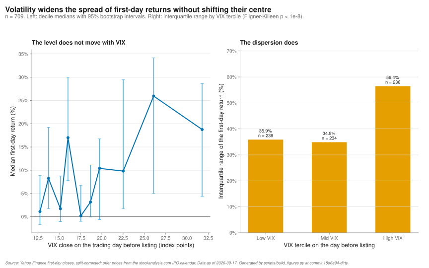

Left: median first-day return by VIX decile, flat within its intervals. Right: interquartile range by VIX tercile, which rises from 35.9% to 56.4%. Market volatility on the day before pricing tells you how *uncertain* the first-day return is, not which way it will go — the one robust finding in this study.

### 6. Feature correlations
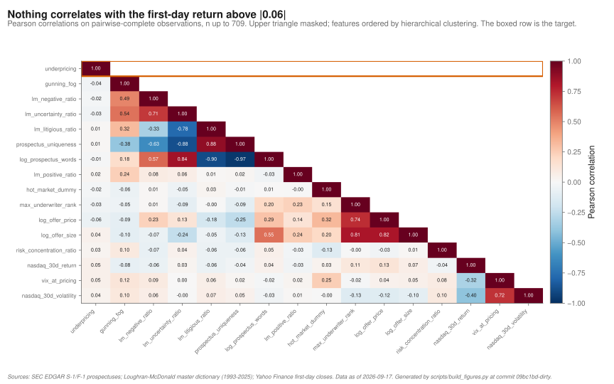

Pearson correlations, upper triangle masked, features ordered by hierarchical clustering so related blocks sit together. The boxed top row is the only one most readers need. Nothing correlates with the first-day return above |0.12|, which is the honest preview of every model result below.

### 7. Litigious tone: the one effect that rejects, and what kills it
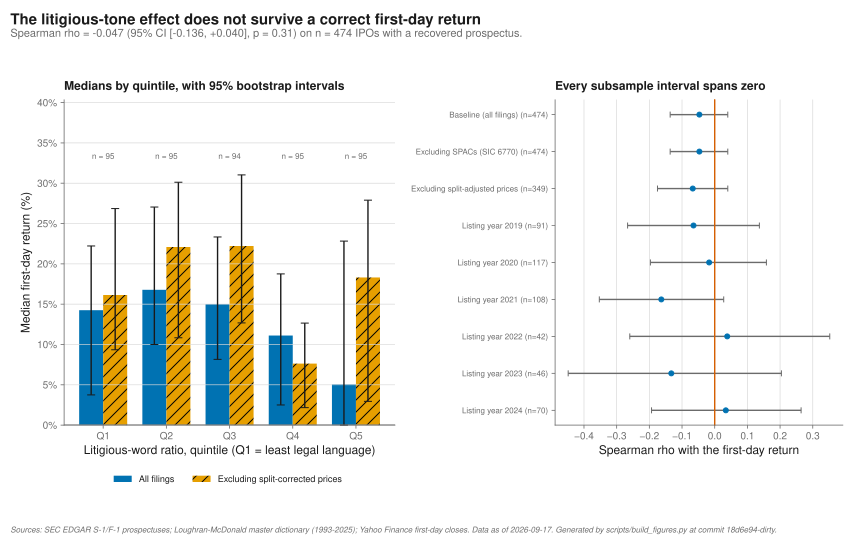

Left: median return by litigious-ratio quintile with 95% bootstrap intervals, shown for all filings and again excluding split-corrected prices. Right: the same association re-estimated across every subsample. Read the left panel's Q2 interval against Q4 and Q5 — they do not overlap, which is the effect. Then read the right panel, where no individual listing year reaches significance and 2022 has the opposite sign.

### 8. Disclosure concentration
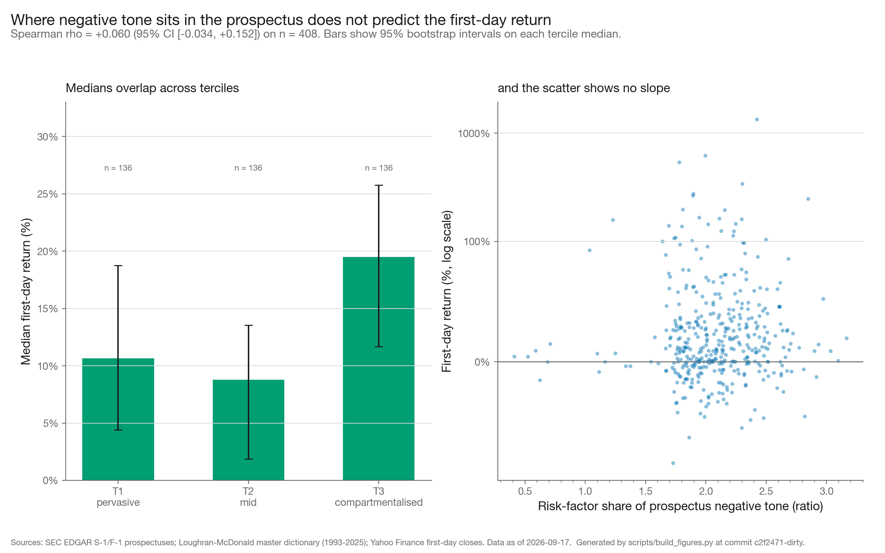

Left: median return by tercile of the risk-factor share of negative tone, with bootstrap intervals. Right: the underlying scatter on a symmetric-log axis. Terciles run +10.7%, +8.8%, +19.5% — not monotone, and the intervals overlap. Where negative language sits in a prospectus does not predict the first-day return (ρ = +0.060, p = 0.22).

### 9. Model performance
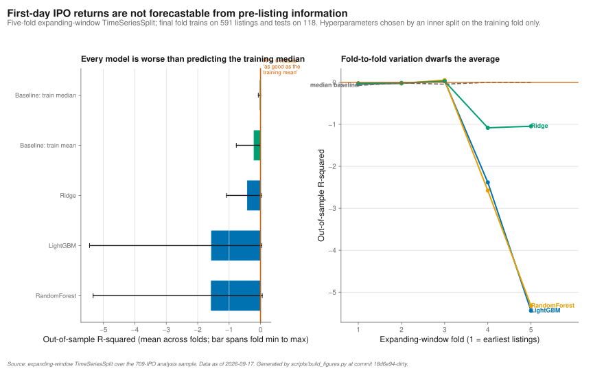

Left: mean out-of-sample R² by model, with the bar spanning the fold minimum to maximum. Right: the same R² fold by fold. Read the right panel before the left: the best any model manages in any fold is R² ≈ 0, and the worst is −6.9, which is exactly why an average across folds is not enough on IPO data.

### 10. Held-out 2024 predictions
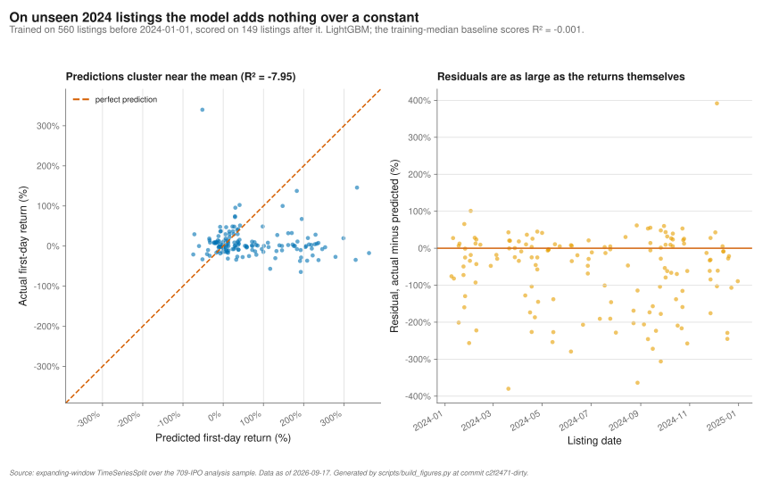

Left: predicted against actual for LightGBM on listings it never saw, with the 45° line. Right: residuals over time. The predictions collapse onto a narrow band near the training mean while the actuals span an order of magnitude, so the residuals are as large as the returns themselves.

### 11. SHAP importance
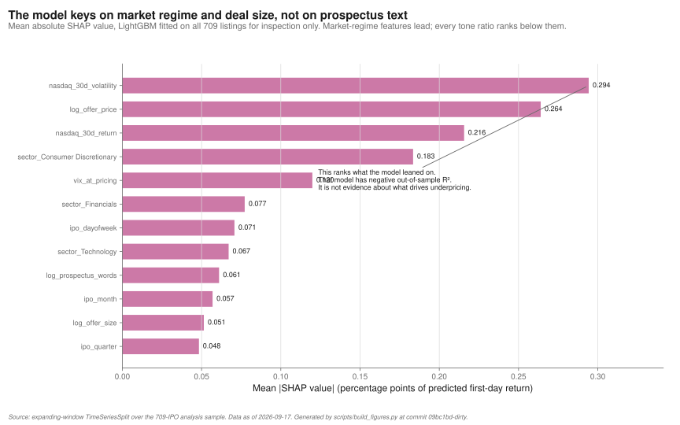

Mean absolute SHAP value for a LightGBM fitted on the whole sample. Read this as a description of the model, not of the world: that model has negative out-of-sample R², so this ranks what it leaned on while failing to generalise. What it leaned on is market regime and underwriter reputation; the highest-ranked tone ratio is fourth.

### 12. Sample funnel
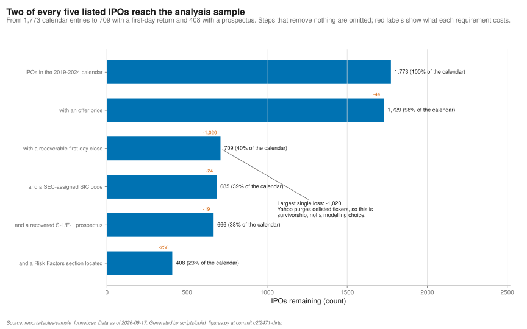

IPOs surviving each requirement, with what each one costs in red. The single largest loss is the 1,020 listings with no recoverable first-day close, which is Yahoo purging delisted tickers rather than a modelling choice. Two of every five calendar entries reach the analysis sample, and 94% of those have a prospectus.

## Validation

### The defect this version corrects

`src/scraper_ipo_calendar.py` mapped stockanalysis.com's `Return` column to `first_day_return_pct`. The cached page header reads `[IPO Date, Symbol, Company Name, IPO Price, Current, Return]`: that column is the return from the offer price to the price **on the day the page was fetched**, not to the first-day close. The project's target was therefore a multi-year holding-period return labelled as underpricing.

| Ticker | Old "underpricing" | True first-day return |
|---|---:|---:|
| PLTR | +1873.7% | +31.0% |
| DASH | +73.3% | +85.8% |
| ABNB | +110.0% | +112.8% |

The sample-level tell was there to read: a median of −4.5% with a 25th percentile of −68.2%. No IPO sample looks like that. The `collapse_floor = -0.50` filter in the old hypothesis tests, described as removing "post-IPO collapses", was the symptom — it was discarding companies that had failed since listing, which only makes sense if the target spans years.

Every figure, every hypothesis test and every headline number in the previous README was computed on this variable.

### Rebuilding the target

`(first_day_close − offer_price) / offer_price`, where the close is the unadjusted price on the first trading day. Three corrections were needed that the old price scraper did not make:

1. **Yahoo's OHLC is split-adjusted even with `auto_adjust=False`.** CrowdStrike's 2019-06-12 close is reported as $14.50 against a true $58.00, because of a 4-for-1 split in 2026. Corrected by the product of subsequent split ratios.
2. **Yahoo lists a split before it restates the series.** NeuroSense has a 1-for-20 dated days before this build with un-restated prices; applying the factor turned a −32.7% return into −96.6%. `split_is_applied()` tests whether the series actually steps at the split date and drops the ones that have not landed.
3. **Tickers get reused.** ASPL's Yahoo history starts in 2007 at a flat $0.34 and has nothing to do with the 2020 SPAC that listed under that symbol.

Validated against eight IPOs whose first-day returns are public record — ABNB, DASH, CRWD, RBLX, PLTR, LYFT, UBER, SNOW — all matching to within 0.1pp. The check is committed as [`tests/test_prices.py`](tests/test_prices.py), along with a shape guard that fails if the target ever again looks like a multi-year return.

### Leakage audit

I checked for look-ahead in the following ways, and found three instances.

| Check | Finding |
|---|---|
| Features derived from first-day price or volume | None reach the model. `select_features` **raises** if a `first_day_*`, `first_week*` or `first_month*` column enters the candidate list, so the rule cannot drift silently. |
| Market-regime features as-of the right date | **Was leaking.** VIX and NASDAQ statistics were read with `index <= ipo_date`, which on a listing day is that day's close — not information anyone had when pricing the night before. Now the last trading day strictly before, with the observation date kept in `market_data_date` so the lag is auditable. |
| Hot-market dummy | **Was leaking.** The trailing 90-day issue count is fine; the tercile threshold it was compared against was computed over the full sample. Now an expanding-window quantile, undefined for the first 100 deals. |
| Sector-level aggregates in prospectus uniqueness | **Was leaking.** Hanley–Hoberg similarity was measured against a sector mean over the whole corpus, so each filing was compared against prospectuses that did not exist yet. Now only earlier same-sector filings, with a five-filing warm-up. The TF-IDF *vocabulary* is still fit on the whole corpus; that keeps scores commensurable across filings and is stated rather than hidden. |
| Target encoding | **Was leaking, badly.** `sector_encoded` and `lead_underwriter_encoded` were the mean of the target within each category over the full dataset. They were fed to the model *and* used as a control in the H1 regression. Both are gone; sector enters as fixed effects fitted inside each fold. |
| LM ratios | Clean. The S-1 is filed weeks before pricing. |
| Underwriter rank | Clean, and now period-correct: Ritter publishes a rank per window and each IPO uses the column covering its listing year, not the latest. |
| Imputation and scaling fitted per fold | Clean. Median imputation, standardisation and sector one-hot all live inside a `sklearn` `Pipeline`, fitted on the training fold only. [`tests/test_hypothesis_and_models.py`](tests/test_hypothesis_and_models.py) asserts the scaler's fitted means differ between a training subset and the full sample. |
| CV ordering | Clean. A test asserts no test observation precedes any training observation in any fold. |
| SIC code vintage | **One caveat I could not remove.** The SEC submissions API returns the registrant's *current* SIC assignment, not necessarily the one in force at the IPO. Reassignment is uncommon and sector enters only as a control, but it is a mild look-ahead and I would rather name it than let it pass. |

### H1 robustness

H1 is the one test that rejects, and the finding the previous version led with, so it gets attacked hardest ([`h1_robustness.csv`](reports/tables/h1_robustness.csv)). Every specification is reported, including the ones that kill it.

| Specification | n | Estimate | 95% CI | p |
|---|---:|---:|---|---:|
| **Rank association** | | | | |
| Baseline, Spearman ρ | 666 | −0.112 | [−0.188, −0.037] | **0.004** |
| Excluding SPACs (SIC 6770) | 666 | −0.112 | [−0.188, −0.037] | **0.004** |
| SPACs only | 0 | — | — | — |
| Excluding split-corrected prices | 453 | −0.140 | [−0.234, −0.046] | **0.003** |
| Listing year 2019 | 100 | −0.071 | [−0.265, +0.124] | 0.48 |
| Listing year 2020 | 130 | −0.090 | [−0.261, +0.087] | 0.31 |
| Listing year 2021 | 138 | −0.155 | [−0.322, +0.017] | 0.07 |
| Listing year 2022 | 65 | **+0.181** | [−0.079, +0.431] | 0.15 |
| Listing year 2023 | 88 | −0.054 | [−0.288, +0.177] | 0.62 |
| Listing year 2024 | 145 | −0.116 | [−0.263, +0.035] | 0.16 |
| **Partial rank correlation** | | | | |
| Controlling for log document length | 666 | −0.096 | [−0.171, −0.020] | **0.013** |
| + deal and market controls | 417 | −0.015 | [−0.112, +0.082] | 0.76 |
| Baseline on that same 417-row subsample | 417 | −0.117 | [−0.211, −0.018] | **0.017** |
| **OLS on the raw target** | | | | |
| Litigious only | 666 | +6.87 | [−10.4, +24.2] | 0.44 |
| + deal and market controls | 439 | −11.5 | [−37.5, +14.4] | 0.38 |
| + log document length | 439 | −14.7 | [−37.7, +8.3] | 0.21 |
| + sector and year fixed effects | 439 | −8.98 | [−38.0, +20.1] | 0.54 |
| **OLS on a winsorised target** | | | | |
| + deal and market controls | 439 | −17.8 | [−37.9, +2.3] | 0.08 |
| + log document length | 439 | −14.3 | [−35.7, +7.2] | 0.19 |
| + sector and year fixed effects | 439 | −13.2 | [−38.0, +11.6] | 0.30 |

Reading this in order:

1. **The bivariate rank association is solid.** ρ = −0.112, p = 0.004, surviving both Bonferroni and Benjamini–Hochberg over the six-test family. It gets *stronger*, not weaker, when the least reliable prices are removed (ρ = −0.140), which is the opposite of what a data-artefact would do. Quintile medians run +17.3%, +20.0%, +7.6%, +2.7%, +2.7%, and the Q2 and Q4/Q5 bootstrap intervals do not overlap.
2. **It survives document length.** The obvious confound — longer prospectuses contain more of everything — costs about 15% of the estimate and leaves it significant (partial rank ρ = −0.096, p = 0.013).
3. **It does not survive the deal.** Adding offer price, offer size, market regime and underwriter reputation takes the partial rank correlation to −0.015, p = 0.76. **That collapse is not a sample-size artefact:** on exactly the same 417 rows the bivariate estimate is −0.117 (p = 0.017). The controls absorb the effect.
4. **No individual year is significant**, five of six are negative, and 2022 is positive.
5. **OLS says nothing either way**, because a target with a +4,950% maximum makes an unclipped least-squares slope a description of two or three observations. Winsorising the target gets the sign right and the point estimate stable around −14 to −18, but never past p = 0.08. I report these rows because leaving them out would be selective, not because they carry weight.

The conclusion I draw is that litigious language is a **marker of what kind of deal this is** — small offering, low price, boutique underwriter, and those deals pop differently — rather than information the market extracts from the prospectus. That is a weaker claim than "the litigious-tone paradox", and it is the claim the data supports.

**The SPAC question answers itself, in the worst way.** The old sample contained 518 SPACs, and the obvious robustness check was to rerun without them. In the corrected sample there are **none**: every one of the 580 name-matched SPACs fails the first-day price fetch, because Yahoo purges the shell ticker once a SPAC completes a de-SPAC or liquidates. The analysis sample is entirely operating companies. That is cleaner in one sense and a large hole in another, and it is in [Limitations](#limitations).

**Is Litigious special among the tone categories?** No. `lm_positive_ratio` is also significant, in the opposite direction (ρ = +0.113, Bonferroni p = 0.024), on the same sample. The previous README's claim that Litigious was "the only LM category whose Spearman p-value survives a Bonferroni correction" was wrong then and is still wrong now, for a different reason.

### Sample funnel and selection

[`sample_funnel.csv`](reports/tables/sample_funnel.csv):

| Step | n | Dropped | % of calendar |
|---|---:|---:|---:|
| IPOs in the 2019-2024 calendar | 1,773 | — | 100.0% |
| with an offer price | 1,729 | 44 | 97.5% |
| with a recoverable first-day close | 709 | 1,020 | 40.0% |
| with a computable first-day return (the target) | 709 | 0 | 40.0% |
| and a SEC-assigned SIC code | 685 | 24 | 38.6% |
| and a recovered S-1/F-1 prospectus | 666 | 19 | 37.6% |
| and a Risk Factors section located | 408 | 258 | 23.0% |

The last row is a separate constraint from the one above it. A prospectus is recovered for 666 of 709 priced IPOs, but Risk Factors can only be located in 408 of them: EDGAR's HTML paginates with a "Table of Contents" marker that section detection anchors on, and roughly 30% of filings do not carry enough of them. The full-prospectus tone ratios — the primary text signal and the basis of H1 — use all 666. Only H3, which needs the Risk Factors subsection, is restricted to 408.

The text-based findings are conditional on a prospectus having been recoverable, and that subset is **not random** ([`selection_comparison.csv`](reports/tables/selection_comparison.csv)):

| Observable | With a filing | Without | Difference | p |
|---|---:|---:|---:|---:|
| Listing year | 2021.64 | 2020.69 | +0.95 | <0.001 |
| Offer price (USD) | 14.27 | 11.72 | +2.55 | <0.001 |
| VIX at pricing | 19.19 | 21.32 | −2.13 | <0.001 |
| First-day return | 0.428 | 0.008 | +0.420 | <0.001 |
| SPAC share | 0.057 | 0.349 | −0.292 | <0.001 |

Filings are recovered disproportionately for larger, later, calmer-market, non-SPAC deals. Read these rows carefully: they compare all 808 recovered filings against the 965 that were not, across the whole calendar, and the group without a filing is dominated by SPACs and by companies that have since delisted. Within the 709 IPOs that reach the analysis sample the gap is much narrower, because only 43 of them lack a prospectus — but that also means the first-day-return row is comparing 666 deals against 43, and I would not lean on it.

The conditioning that matters is the one above it in the funnel: the analysis sample is the 40% of listed IPOs whose first-day price is still recoverable, and every number in this README is conditional on that.

### Pre-registration

These hypotheses were **not** pre-registered. H1 and H3 were specified after exploratory work on the same data, so their p-values are optimistic in a way that no correction fully repairs. H2, H4, H5 and H6 are directional predictions taken from the prior literature.

This matters most for H1, which is the one test that rejects. A Bonferroni-corrected p of 0.023 on a hypothesis chosen after looking at the same data is not the same object as a corrected p on a pre-registered one, and I would not describe it as confirmed evidence. What would settle it is the same test on IPOs outside this window, which I have not run.

One further disclosure: the partial-rank and winsorised-OLS specifications in the H1 table were added *after* seeing that unclipped OLS on this target was uninformative. I added them because least squares on a variable with a +4,950% maximum is a known failure mode, not because of which way they came out — and as it happens the partial-rank row is the one that kills the finding.

## Limitations

This is the section I would read first.

**The sample contains no SPACs, and that is not a design choice.** 580 of the 1,773 calendar entries are blank-cheque companies and every one of them fails the price fetch, because Yahoo removes the shell ticker after a merger or liquidation. Roughly a third of the 2019–2024 IPO market is simply absent from my results, and it is the third with the most distinctive prospectus language and the most unusual return distribution. Any statement I make about "US IPOs" means "US operating-company IPOs that were still findable on Yahoo in September 2026".

**The same purge creates survivorship bias in what remains.** I recover a first-day close for 709 of 1,729 listings with an offer price. Those 1,020 losses are not random: they are concentrated in companies that delisted. Re-running this scrape in a year would recover fewer still. A study built on a point-in-time commercial database would not have this problem, and I would build it that way with access to one.

**Filing recovery is now good but section extraction is not.** 666 of 709 priced IPOs have a recoverable prospectus, so the old selection problem on the text sample is largely gone. Risk Factors, though, can only be located in 408 of them, because section detection depends on EDGAR's page-break markers and roughly 30% of filings do not carry enough. H3 is the test that pays for this.

**31% of first-day prices required a split correction I cannot fully verify.** My correction is validated against eight known IPOs and detects splits Yahoo has announced but not applied, but Yahoo's split calendar is demonstrably incomplete for micro-caps: CPOP's reported +4,950% first-day return implies a restatement factor of 303 against a split history that accounts for 10. I keep the row, flag it, and report every headline result with and without split-corrected prices — but I believe a handful of extreme values in the right tail are still wrong, and they are why I lead with medians and rank-based tests rather than means.

**`prospectus_uniqueness` is close to a length measure.** It correlates −0.965 with log document length. Whatever Hanley–Hoberg informativeness is, this implementation is not cleanly capturing it, and I would rebuild it against a within-sector length-matched comparison set before using it again.

**Deal size is the filed amount, not the priced amount.** It is extracted from the prospectus cover for 439 of 666 filings, and it is the base offering in the preliminary prospectus — before any over-allotment and before final pricing. There is no shares-offered or proceeds field anywhere in my sources. This matters more than it looks: the deal and market controls are what kill H1, and one of them is measured on two-thirds of the sample with a regex.

**The window contains one extreme regime and it may be driving everything.** The 2020–21 issuance boom has a median first-day return of +27.7% and +10.5% against 0.0% in 2023. Six years is three or four genuine market regimes, not a long sample.

**Underpricing here is offer-to-first-close, which is not a return anyone earned.** It assumes allocation at the offer price, and allocation in a hot IPO is exactly what retail and most institutions do not get. The economically interesting quantity — money left on the table conditional on the allocation you would actually have received — is not measurable from public data.

**H1 rejects, and I do not think it means what it appears to mean.** The bivariate association is significant after correction and robust to the checks I can run, but it vanishes under deal and market controls, and I cannot separate "litigious language proxies for deal type" from "litigious language carries information that deal characteristics also carry". The controls are themselves imperfectly measured. Someone attacking this result would start with the offer-size regex.

**Nothing here is causal.** Every estimate is a conditional correlation on observational data with no identification strategy. Where I use the word "predict" I mean it in the forecasting sense, and the forecasting result is negative.

**What a proper version of this study would need:** Dealogic or Refinitiv for a point-in-time deal universe that does not vanish when a company delists; actual bookbuilding data, in particular the price-range revision, which Hanley (1993) shows is the single strongest known predictor of first-day returns and which I have no way to observe; allocation data; and a sample long enough to span more than one issuance cycle.

**Hardware- and version-dependent numbers:** none of the results above are hardware-dependent. They do depend on library versions — the model table was produced with scikit-learn 1.3.2 and LightGBM 4.5.0 on Python 3.12 — and on the pinned LM dictionary release, whose hash is asserted at fetch time.

## Data sources

| Source | URL | As-of | Terms | Refresh |
|---|---|---|---|---|
| IPO calendar | <https://stockanalysis.com/ipos/> | 2026-09-17 | Snippets with attribution allowed; republishing in full is not. Not redistributed here. | `python -m src.scraper_ipo_calendar` |
| First-day and index prices | Yahoo Finance via `yfinance` | 2026-09-17 | Personal/research use | `python -m src.scraper_prices` |
| S-1 / F-1 filings | <https://www.sec.gov/edgar> | 2026-09-17 | US government work, public domain | `python -m src.scraper_edgar` |
| SIC codes | <https://data.sec.gov/submissions/> | 2026-09-17 | US government work, public domain | `python scripts/fetch_sic_codes.py` |
| LM Master Dictionary 1993-2025 | <https://sraf.nd.edu/loughranmcdonald-master-dictionary/> | 2026-09-17 | Free for academic research; commercial use needs a licence | `python scripts/fetch_lm_dictionary.py` |
| Carter-Manaster underwriter ranks | <https://site.warrington.ufl.edu/ritter/ipo-data/> | 2026-09-17 | Public academic resource | `python scripts/fetch_underwriter_ranks.py` |

Both fetch scripts assert a SHA-256 on the downloaded file and fail loudly rather than letting an upstream revision move every number downstream. See [NOTICE](NOTICE) for what is redistributed and under what terms.

### Scraping conduct

- **SEC EDGAR.** Fair access requires a descriptive `User-Agent` naming a contact and caps traffic at 10 requests per second. This project throttles to 8 r/s with exponential backoff, and reads the contact from `SEC_EDGAR_USER_AGENT` — it refuses to run without one, rather than shipping a placeholder address as an earlier version did.
- **stockanalysis.com.** `robots.txt` disallows only `/e/` and `/p/`, not `/ipos/`. Requests are throttled to 2 per second and year pages are cached on disk, so a re-run costs no traffic. Their terms of use state that republishing their content in full is not permitted without permission while snippets with attribution are; the raw scrape is therefore not committed to this repository.
- **Yahoo Finance.** One request per ticker with a courtesy pause. `yfinance` is an unofficial client and the endpoint is not a supported API; a rate-limited or empty response is recorded as a status rather than retried aggressively.

## References

1. Loughran, T., & McDonald, B. (2011). When is a liability not a liability? Textual analysis, dictionaries, and 10-Ks. *Journal of Finance*, 66(1), 35–65. — The finance-specific dictionary; the misclassification argument is at pp. 36–38.
2. Hanley, K. W., & Hoberg, G. (2010). The information content of IPO prospectuses. *Review of Financial Studies*, 23(7), 2821–2864. — Informative content versus boilerplate, and the motivation for the uniqueness measure.
3. Ritter, J. R., & Welch, I. (2002). A review of IPO activity, pricing, and allocations. *Journal of Finance*, 57(4), 1795–1828. — The benchmark statement that first-day returns are close to unforecastable from public pre-IPO information.
4. Carter, R. B., & Manaster, S. (1990). Initial public offerings and underwriter reputation. *Journal of Finance*, 45(4), 1045–1067. — The reputation measure and the certification hypothesis behind H2 and H5.
5. Loughran, T., & Ritter, J. R. (2004). Why has IPO underpricing changed over time? *Financial Management*, 33(3), 5–37. — The rank updates behind the file used here, and the rank ≥ 8 prestige cut-off.
6. Hanley, K. W. (1993). The underpricing of initial public offerings and the partial adjustment phenomenon. *Journal of Financial Economics*, 34(2), 231–250. — Price-range revision as the strongest known predictor, and the main variable this study cannot observe.
7. Benjamini, Y., & Hochberg, Y. (1995). Controlling the false discovery rate. *Journal of the Royal Statistical Society B*, 57(1), 289–300.
8. Gunning, R. (1952). *The Technique of Clear Writing*. McGraw-Hill.
9. Okabe, M., & Ito, K. (2008). Color Universal Design. <https://jfly.uni-koeln.de/color/> — The figure palette.

## Author

Lyonn Lie — [github.com/leeyawnnn](https://github.com/leeyawnnn)

Apache-2.0. See [LICENSE](LICENSE) and [NOTICE](NOTICE).
